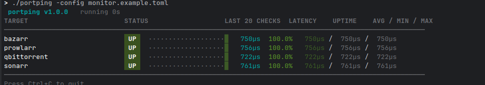

# portping

A TCP/HTTP service monitor with a live terminal dashboard. Zero dependencies beyond the Go standard library.

`portping` continuously probes a set of services and renders an auto-updating dashboard showing status, latency, uptime, and a rolling history of recent checks.



## Features

- **TCP and HTTP/HTTPS probes** — check raw ports or HTTP health endpoints
- **Live dashboard** — refreshes in place, down services float to the top
- **Per-target stats** — uptime %, current latency, and avg / min / max
- **Rolling history** — the last 20 checks at a glance
- **Custom labels** — give targets friendly names
- **Config file or CLI args** — define targets inline or in a TOML file
- **No external dependencies** — pure Go standard library

## Install

```sh
go install
```

Or build the binary:

```sh
go build -o portping .
```

## Usage

```sh
portping [options] [target ...]
portping -config <file>
```

### Targets

| Form                          | Description                            |
| ----------------------------- | -------------------------------------- |
| `host:port`                   | TCP probe (e.g. `localhost:5432`)      |
| `label=host:port`             | TCP probe with a custom label          |
| `http://host:port/path`       | HTTP probe (status 200–499 counts up)  |
| `https://host/path`           | HTTPS probe on port 443                |
| `label=https://api.acme.com`  | HTTP probe with a custom label         |

### Options

| Flag         | Default | Description                |
| ------------ | ------- | -------------------------- |
| `-interval`  | `5s`    | Probe interval             |
| `-timeout`   | `3s`    | Probe timeout              |
| `-config`    | —       | TOML config file           |
| `-version`   | —       | Print version and exit     |

### Examples

```sh
# Monitor a couple of local services
portping localhost:5432 redis.internal:6379

# Custom interval and timeout against an HTTPS endpoint
portping -interval 2s -timeout 1s api.acme.com:443

# Custom labels
portping "DB=localhost:5432" "Cache=localhost:6379"

# Load targets from a config file
portping -config monitor.toml
```

## Config file

Targets can be defined in a TOML file:

```toml
[[target]]
label = "Postgres"
host  = "localhost"
port  = 5432
proto = "tcp"

[[target]]
label = "API"
host  = "api.example.com"
port  = 443
proto = "http"
path  = "/healthz"
```

Run it with:

```sh
portping -config monitor.toml
```

See [`monitor.example.toml`](monitor.example.toml) for a working example.

## License

MIT
